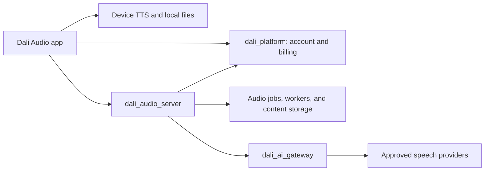

# Dali Audio App Design

Status: Proposed product and application design

Date: 2026-09-08

Related: [service architecture](dali_audio_architecture.md),
[product vision](dali_audio_product_vision.md), and
[Gateway / Chat technical spike](dali_audio_technical_spike.md).

## 1. Product

Dali Audio turns a user's text into spoken audio. Users can paste or write
text, import a text file or PDF, choose a free device voice or a paid AI voice,
and either listen immediately or create an audio file for later use.

The app uses the standard Dali account experience established by Interpreter
and Scribe. Dali Platform remains the identity, entitlement, and billing
authority. Dali Audio owns its documents, reading sessions, and audio jobs.

This is a design document, not an implemented app. The existing Dali Chat
spike validates paid speech transport and Android playback. It does not yet
provide document import, device TTS, durable jobs, or a Dali Audio account grant.

## 2. Three Independent Choices

| Choice | Options | Default |
| --- | --- | --- |
| Text source | Write/paste text; import `.txt`; import `.pdf` | Write/paste |
| Voice engine | Device voice — Free; AI voice — Paid | Device voice |
| Conversion | Read now; Create audio | Read now |

Use these user-facing labels consistently. “AI voice” means cloud speech
generation through an approved model; selecting it does not rewrite the text.
“Read now” means incremental playback with a short startup wait, not a
microphone conversation. “Create audio” means a file-producing job.

| Engine and mode | Execution | Result | App can close? |
| --- | --- | --- | --- |
| Device voice / Read now | On-device speech engine | Immediate listening | Lock-screen playback is a separate platform capability to verify |
| Device voice / Create audio | On-device synthesis-to-file, where supported | Local audio file | No guaranteed completion after process termination; resume on reopening |
| AI voice / Read now | Audio server coordinates bounded synthesis through Gateway | Incremental playback | Closing stops further generation; lock-screen playback requires platform support |
| AI voice / Create audio | Durable Audio server job | Downloadable audio file | Yes; server continues independently |

Free means no Dali AI generation charge. It does not promise every device
voice works offline or supports file export. Prefer verified offline voices;
label network-dependent voices and require a network connection when needed.
Unavailable combinations explain the limitation before starting. Never switch
to a paid voice automatically. Native voice/export support needs an Android
and iOS feasibility spike before a release commitment.

## 3. Navigation and Main Screen

Use three primary destinations: **Create**, **Library**, and **Account**.
Show a compact persistent player while audio is active.
Place **Reading settings** under Account and provide a shortcut from the
reader's voice control. These settings supply the defaults for Read now.

The Create screen follows the user's decisions in order:

1. **Text:** Write/paste or Import document. Show editable text, word count,
   and approximate listening duration after import.
2. **Voice:** Device voice / AI voice, language, and available voices. Show
   Free or Paid beside the engine, not only inside a settings page.
3. **Delivery:** Speaking rate for supported voices. AI voices may expose a
   small set of delivery presets and optional instructions. Unsupported
   controls are hidden or disabled with an explanation.
4. **Conversion:** Read now / Create audio. For file creation show the output
   format, destination, estimated duration, and applicable storage information.
5. **Action:** Start reading or Create audio. Paid actions show an estimate
   and require explicit acceptance before chargeable generation begins.

Keep provider/model details in optional voice information; the primary
selection is a recognizable voice name, language, sample, and price category.
Provide a voice sample. An on-demand AI preview is chargeable and must show
that fact; replaying an existing sample does not trigger new synthesis.

### 3.1 Voice Selection and Consistency

Users select a named voice from a catalog, independently of delivery style.
OpenAI accepts an explicit `voice`, such as `coral`; Gemini accepts a named
prebuilt voice such as `Kore`. These are structured synthesis settings, not
merely descriptions in a prompt. See the
[official OpenAI speech guide](https://developers.openai.com/api/docs/guides/text-to-speech)
and [Google speech guide](https://ai.google.dev/gemini-api/docs/speech-generation)
(reviewed 2026-09-08).

The product promise is to retain and submit the selected voice configuration
or stop with an explanation. The reviewed documentation does not establish a
guarantee of identical waveforms, delivery, or permanent acoustic identity
across requests and model updates. Style, language, text, and generation can
affect the result. Existing audio is the reproducible artifact: replay it
instead of regenerating when identical sound is required.

Each catalog entry has a stable Dali voice ID and immutable version mapped to
one provider, model/snapshot where supported, and concrete provider voice ID.
Store that version plus language, delivery settings, and Gateway configuration
ID in each job revision. A name such as “Warm narrator” must not silently move
from OpenAI Coral to Gemini Kore. Those are separate voices even if they have
similar descriptions. The current spike's `narrator_main` alias is scoped to
a Gateway profile; it is not one acoustic identity shared across providers.

Voice cards show a sample, descriptive tags, supported/tested languages, price,
and availability. Let the user favorite a voice and set it as the default.
Use neutral sample text and representative language-specific samples; identify
them as AI-generated. Keep samples versioned with the voice configuration.
For a long document, offer a short preview of the user's text before creating
the whole file, with the normal paid-preview cost disclosure.

Use the same configuration and delivery template for all segments. Evaluate
long-form consistency across segment boundaries, numbers, punctuation, and
language changes before marking a voice suitable for long narration. A preview
is useful evidence, not a guarantee that an hour of output will be uniform.
Expose section regeneration for correction and retain unchanged audio.

If a voice/model is removed or configuration drifts, pause affected generation
and ask the user to choose or approve a replacement. Do not automatically
switch to another voice/provider. A model upgrade creates a new catalog
version and requires fresh samples and listening evaluation. Configuration
pinning cannot freeze undisclosed provider changes; maintain a regression
listening set and retire versions that no longer meet quality expectations.

Custom voice creation/cloning is outside the MVP. This design covers choosing
provider-supplied voices, not recreating an arbitrary person's voice.

### 3.2 Reading Settings and Per-Text Creation Options

Provide the same voice picker in two places, with distinct save behavior:

| Surface | Settings | Effect |
| --- | --- | --- |
| Reading settings | Device/AI engine, language, named voice, supported speaking rate and delivery preset | Save as defaults for future Read now sessions |
| Create audio options for a text | Engine, language, named voice, supported speaking rate/delivery, and output format | Apply to this text's new audio job only |

Every voice row has an explicit **Listen** control alongside its name and
Free/Paid label. Listening does not select or save the voice. Selecting a row
does not start preview playback or generation. Provide a separate selected-
configuration preview so users can hear supported rate and delivery changes.

In Reading settings, users compare voices with Listen, select their preferred
configuration, and tap **Save reading settings**. Store preferences locally,
scoped to the Dali account; cross-device preference sync is deferred. Validate
voice availability before use, especially device voices. Settings changes apply
to the next reading session; an active session offers an explicit apply action
at a paragraph boundary rather than changing voices mid-sentence.

When a user chooses Create audio for a text, open a configuration sheet
initialized from their reading settings. Show the effective choices even when
defaults are available. They can compare voices, change settings for this
text, and tap **Listen to this text** to preview a short visible excerpt using
the selected settings. Allow choosing the excerpt. Show an updated estimate
before the separate **Create audio** action starts the full job.

Creating audio does not overwrite reading preferences. An optional
**Also save as reading settings** choice is off by default. Reopening options
for an existing draft restores its own choices; an existing job retains its
immutable configuration. Changing a completed job creates a new revision.

### 3.3 Listen Preview Behavior

Catalog **Listen** plays a short, versioned sample in the selected language
where available. Device samples use the local engine; AI catalog samples are
pre-generated product assets and carry no user generation charge. An unavailable
sample shows its status and recovery action; it never silently triggers paid
generation. A sample in another language is labeled explicitly.

**Listen with these settings** and **Listen to this text** use the actual
selected configuration. When they require new AI generation, display the
preview price and obtain explicit acceptance. Limit previews to a short excerpt
with a published size/duration bound. The full document is not generated as a
preview. Replaying unchanged preview audio reuses the existing bytes. Changes
to text, voice, language, rate, or delivery mark that preview out of date and
require a fresh preview to represent the new settings.

Show loading, playing, stopped, unavailable, and failed states. The Listen
control becomes **Stop** while playing; starting another sample stops the
previous one. Pause active narration before a preview and leave resumption to
the user. Failure preserves the selection and offers retry. Previews remain
optional: users can save settings or create audio without listening first.

## 4. Text and Document Input

Support manually entered text, UTF-8 text files, and text-bearing PDFs first.
Import creates a draft; it must not immediately start narration or upload
content for paid synthesis. Preserve paragraph structure and, where available,
PDF page references. Let users select pages or passages before conversion.

After PDF extraction, show **Review text**. Reading order, columns, headers,
footers, and hyphenation can need correction. Offer reversible cleanup such
as removing repeated headers, and show the changed text before approval.
Do not silently summarize, translate, or editorially rewrite the document.

For scanned/image-only PDFs, explain that text extraction is unavailable in
the first release and offer pasted text or another file. OCR is a later,
explicit capability with its own processing and price disclosure. Password-
protected or malformed PDFs fail with an actionable message; no automatic
cloud fallback. Define and enforce byte, page, and extracted-text limits on
both client and server before release.

Prefer local extraction so device-voice reading does not require uploading
the document. The MVP cloud path receives reviewed text only, not the original
PDF. If local extraction proves insufficient, server extraction requires an
explicit design update and user-visible upload choice.

Estimated duration is advisory and depends on language, voice, and pace. It is
not a provider-token measurement or a final billing amount.

## 5. Read Now

The reader shows approved text, the current paragraph, voice, progress, and
play/pause, stop, previous/next paragraph, and supported playback-speed controls.
Use paragraph highlighting as the baseline. Word-level highlighting is only
offered where trustworthy timing or native callbacks exist.

Device reading runs locally with no Gateway request or AI charge. Paid reading
synthesizes bounded segments and starts playback when the first segment is
ready. Prefetch is limited to a small configured window; pausing stops new
requests beyond that window, and stopping cancels unscheduled work. Explain
that generated/prefetched segments can incur charges even if not listened to.

Seeking within buffered audio reuses it. Seeking to an ungenerated passage
may require new synthesis under the accepted budget. Changing text or voice
invalidates only affected future segments and requests a revised cost decision
where necessary. Never replay a passage by silently generating it again.

Distinguish playback speed from synthesis delivery rate: changing playback
speed on existing audio does not regenerate it. Changing synthesized delivery
creates new audio and can cost money.

Network loss pauses AI reading with retry/resume controls. Keep the current
position and available buffer; do not automatically change provider or voice.
Read-now cloud buffers are transient and expire when the session ends. Saving
a durable result is an explicit Create audio action with its own estimate.

## 6. Create Audio

A job captures an immutable copy of approved text and selected voice settings.
Later draft edits do not change an active job. Divide long documents at
paragraph/sentence boundaries within effective provider limits. An hour-long
document must not be submitted as one speech request.

For paid cloud jobs, show an estimate and spending ceiling, authorize through
Platform, enqueue durably, and return a job reference promptly. Workers save
completed segments and assemble the file after all required segments succeed.
The job continues while the app is closed; polling on return restores status.
Push completion notifications can follow the initial polling implementation.

Job states: **Queued → Generating → Assembling → Ready**, with **Failed** and
**Cancelled** outcomes. Display completed sections out of total and phase;
show time remaining only when there is a reasonable estimate.

Cancellation stops scheduling new segments. Already accepted provider work
may finish and incur charges. A failed job retains completed sections within
retention, offers retry of failed sections, and never presents an incomplete
file as a completed result. Retry cost is disclosed; no unlimited auto-retry.

For free local file creation, use a native export capability only after it is
verified. Persist local segment progress so interrupted work can resume on
reopening. Label the task **On this device** and explain any requirement to
keep the app open. Do not represent it as a durable server job.

Offer one compressed export format in the first release, proposed M4A/AAC,
subject to encoder and cross-device playback verification. Normalize container,
sample format, and boundaries during assembly; never concatenate raw WAV files.
WAV may be a later export option. The Gateway spike's Android WAV-header fix
is an existing transport requirement, not a substitute for final-file QA.

After completion, users can play, download, rename, share through the OS share
sheet, or delete the result. No public share links in the first release.
Later section regeneration creates a new revision while reusing unchanged
audio. Completed output retains its voice/configuration metadata.

## 7. Library and Storage

Library contains drafts, active jobs, and completed audio. Each item shows
title, voice, estimated/actual duration, state, and storage location:
**On this device**, **In cloud**, or **Downloaded**. Titles are product content
and must not enter logs or Platform usage records.

Device-voice drafts and results remain local. Cloud file creation uploads the
approved text and stores the source snapshot, segment assets, and final output
in Audio-owned storage. Explain this at submission. A cloud job is not an
implicit backup of the user's original PDF.

Set explicit retention periods before launch and display expiry where relevant.
Allow downloading before expiry. Distinguish **Remove download** from **Delete
project**; project deletion cancels work and removes its cloud content and local
copies under the documented deletion policy. Previously exported external
copies are outside the app's control.

Scope local libraries and caches to the signed-in account. Account switching
must never expose another account's text, audio, or queued operations.

## 8. Standard Dali Account Experience

Reuse the established Interpreter/Scribe interaction pattern and shared
Platform contracts, without importing their product runtime or data models.

Account provides:

- Sign in, registration, and password/account recovery through Dali Platform.
- Identity/profile, session refresh, and secure device session storage.
- Audio entitlement, available balance/allowance, plans, and usage history.
- Purchase/manage plan and restore purchases where the deployed Platform and
  store integration supports them; show only enabled capabilities.
- Sign out and account switching with account-scoped local data handling.
- Delete Dali account with reauthentication and a clear explanation that this
  affects the shared Dali identity, distinct from deleting one Audio project.

Proposed MVP: normal account onboarding, with no paid entitlement required for
device voices. An existing signed-in user can keep using offline device
features while disconnected. Anonymous/guest mode is deferred unless approved
as a separate product choice.

Register an Audio-specific audience, scope, product grant, and entitlement in
Platform before enabling paid service calls. Exact identifiers must follow the
released contract; do not reuse a Chat, Scribe, or Interpreter token audience.
The Audio server checks ownership and entitlement for every cloud operation.
The client never receives a Gateway service credential or provider API key.

Signing out ends live reading and clears credentials and transient buffers.
Already-authorized cloud jobs continue within their accepted ceiling and remain
owned by the original account; disclose this in the sign-out flow and offer
cancellation. Account deletion cancels outstanding Audio work and propagates
content deletion. Subscription cancellation uses the appropriate billing/store
flow and is not assumed to occur merely because the app is uninstalled.

## 9. Price and Usage UX

Device voices display **Free — no AI generation charge**. Paid voices display
a Platform-derived estimate before generation, with currency, selected voice,
expected duration, and what is included. Preview, regeneration, and failed or
ambiguous attempts follow the explicit Platform charging policy.

Do not hard-code the earlier provider-cost estimates as Dali retail prices.
Provider cost, Dali customer price, storage, and subscription allowance are
separate concepts. The pricing catalog and ledger belong to Platform.

Reserve/authorize a budget before cloud work, stop new attempts before exceeding
it, and reconcile actual usage afterward. A larger job or changed configuration
requires a new estimate/authorization. Content-free event identifiers support
deduplication; job totals and segment events must not charge twice.

Replay and download of existing audio do not incur a new synthesis charge.
Any separate delivery/storage fee must be disclosed, not hidden in generation.

## 10. Service Boundaries

`dali_audio_server` is both the app backend and shared narration service, as
agreed in the architecture. It owns document snapshots, segmentation, live
reading coordination, durable jobs, revisions, assembly, authorization, and
authorized downloads. API and worker processes can share one release.

The Gateway remains private and stateless: authenticated Dali service traffic,
provider transport, routing, admission, and content-free measurements only.
No audio, text, user identifiers, or durable jobs are stored or logged there.
Platform receives identity/billing data and content-free usage, never documents,
text, audio, filenames, or download URLs.

Live reading and background generation need independently bounded scheduling.
Audio background jobs must respect Gateway workload limits and never consume
the documented Host reserve. Do not add a separate `audio_gateway` service.

## 11. Proposed Product Contracts

Define these in the Audio server, not in Gateway OpenAPI:

| Resource or operation | Responsibility |
| --- | --- |
| Capabilities | Enabled modes, voices, controls, input limits, export formats |
| Estimate | Versioned price decision and proposed spend ceiling |
| Reading session | Position, bounded generation, pause/stop, transient segments |
| Narration job | Idempotent creation, immutable settings, status and cancellation |
| Revision | Source/voice lineage and selective regeneration |
| Asset | Account-authorized playback/download and expiry |
| Project deletion | Cancel work and delete related product content |

Native capabilities are discovered on the device and combined with the server
catalog; server availability cannot establish installed device voices. Durable
job metadata records engine, voice, language, delivery, source revision, and
effective Gateway configuration ID. Configuration drift requires review rather
than silent voice substitution. Correlation mapping from inference to account
stays in the Audio service.

## 12. Delivery and Acceptance

1. **Device reading:** Flutter app shell, standard Dali account flow, local
   text/PDF extraction review, device voices, and Read now. Verify actual native
   voice availability, offline behavior, interruptions, and export feasibility.
2. **Paid reading:** Audio-specific Platform grant, estimate/authorization,
   Audio server and Gateway integration, incremental playback, bounded prefetch,
   stop/resume, and billing reconciliation.
3. **Background output:** durable cloud jobs, long-document segmentation,
   assembly, recovery, cancellation, Library, authorized download, and deletion.
   Add free local export on platforms that passed the feasibility gate.
4. **Refinement:** section regeneration, pronunciation controls, notification
   delivery, additional formats, and optional OCR after explicit design review.

Acceptance checks must demonstrate:

- A pasted passage, text file, and text-bearing PDF reach editable review.
- Free reading makes no paid inference request; unsupported export is explained.
- Paid preview, reading, and file creation show cost before chargeable work.
- Pause/stop bounds new generation; replay uses existing audio.
- Reading settings persist per account and initialize future reading sessions.
- Every voice choice offers Listen in both settings and per-text creation;
  preview playback never silently selects a voice or creates a full job.
- Per-text voice overrides preserve reading defaults unless explicitly saved;
  custom AI previews disclose cost and reuse unchanged audio on replay.
- An hour-long test document completes as segments with ordered, playable output.
- Cloud generation survives app closure and worker restart without duplicate
  published output or duplicate ledger events.
- Local interruption resumes or explains recovery without promising server uptime.
- Account switching and direct API requests cannot expose another user's assets.
- Import, synthesis, and playback failures preserve the draft and offer recovery.
- Deletion, retention, billing reconciliation, and Host capacity isolation work.
- Screen readers, scalable text, labeled controls, and player focus order work.

Before implementation, resolve first-release device targets, native export
support, document size limits, output codec, storage retention, and Platform
Audio pricing/grants. These are explicit implementation gates; they do not
change the three product choices or the agreed service separation.
